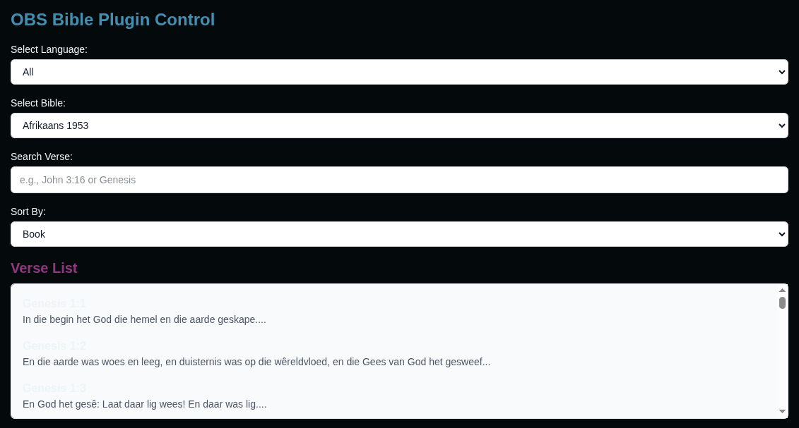

# OBS Bible Plugin

This is a Next.js project that functions as an OBS (Open Broadcaster Software) Bible Plugin, allowing users to display Bible verses on their streams with customizable styling. It uses Socket.IO for real-time communication between the control dashboard and the OBS overlay.

## Features

*   **Real-time Verse Display:** Show Bible verses on your OBS stream.
*   **Customizable Styling:** Adjust font size, font family, text color, background color, background image (from URL), background opacity, and text alignment.
*   **Control Dashboard:** A web-based interface to select Bibles, search verses, preview, and control the display.

## Getting Started

Follow these steps to set up and run the project locally.

### Prerequisites

*   Node.js (LTS version recommended)
*   npm (Node Package Manager) or Yarn

### Installation

1.  **Clone the repository:**

    ```bash
    git clone <repository_url> # Replace with your repository URL
    cd "BIBLE plugin" # Navigate into the project directory
    ```

2.  **Install dependencies:**

    ```bash
    npm install
    # or
    yarn install
    ```

### Running the Development Server

To start the development server:

```bash
npm run dev
# or
yarn dev
```

The application will be accessible at `http://localhost:3000`.

### Accessing the Application

*   **Main Page:** `http://localhost:3000`
    *   Provides an overview and the OBS Browser Source URL.
*   **Control Dashboard:** `http://localhost:3000/control`
    *   Use this page to select Bibles, search for verses, customize styles, and send verses to your OBS stream.
*   **OBS Browser Source Overlay:** `http://localhost:3000/overlay`
    *   Add this URL as a "Browser Source" in OBS to display the verses.

## Project Structure

*   `app/`: Next.js application pages (main, control, overlay).
*   `lib/data/`: Stores Bible data in JSON format, organized by language.
*   `lib/bibleLoader.js`: Utility for loading Bible data.
*   `server.js`: Custom Node.js server integrating Next.js and Socket.IO.

## Learn More

To learn more about Next.js, take a look at the following resources:

-   [Next.js Documentation](https://nextjs.org/docs) - learn about Next.js features and API.
-   [Learn Next.js](https://nextjs.org/learn) - an interactive Next.js tutorial.

You can check out [the Next.js GitHub repository](https://github.com/vercel/next.js) - your feedback and contributions are welcome!

## Deploy on Vercel

The easiest way to deploy your Next.js app is to use the [Vercel Platform](https://vercel.com/new?utm_medium=default-template&filter=next.js&utm_source=create-next-app&utm_campaign=create-next-app-readme) from the creators of Next.js.

Check out our [Next.js deployment documentation](https://nextjs.org/docs/app/building-your-application/deploying) for more details.